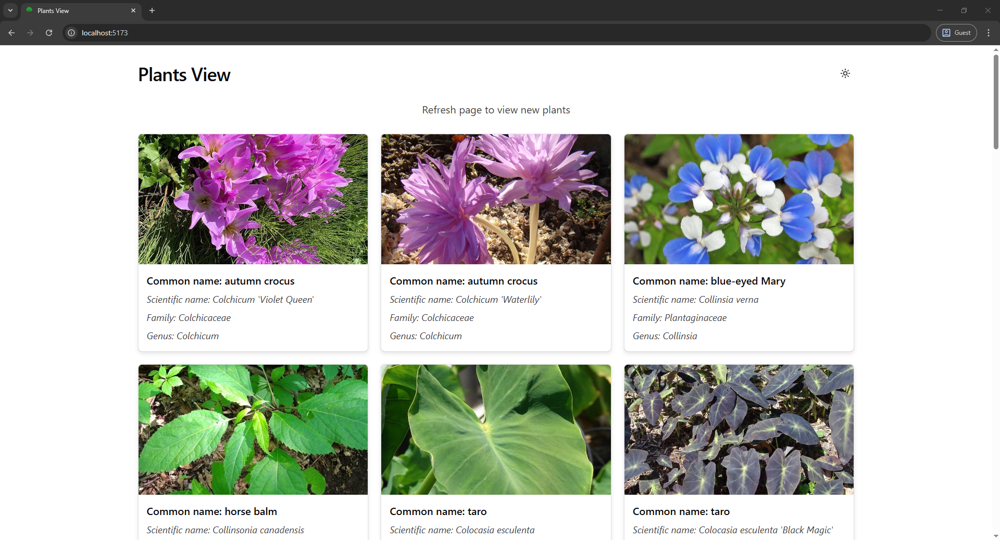

# Plants View 🌿

Page for viewing random plants around the world.

## Preview



## Tech Stack

- React
- TypeScript
- Vite
- Chakra UI

## API

- The API used is the [Perenual API](https://perenual.com/), specifically the endpoint `https://perenual.com/api/v2/species-list`.
- The API key is required to use the API.

### Environment Variables

- `VITE_API_KEY`: The API key for the Perenual API.
- `VITE_API_URL`: The API URL for the Perenual API.

## Installation

- Clone this repository. And then install the dependencies using:

```bash
npm install
```

## Running

- Run the development server using:

```bash
npm run dev
```

## License

MIT
